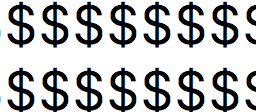

# References

- [Markdown - Wikipedia](https://en.wikipedia.org/wiki/Markdown)
- [Mastering Markdown - GitHub Guides](https://guides.github.com/features/mastering-markdown/)
- [Writing on GitHub - GitHub Help](https://help.github.com/categories/writing-on-github/)
- [GitHub Flavored Markdown Spec](https://github.github.com/gfm/)
- [Emoji Cheat Sheet](https://www.webpagefx.com/tools/emoji-cheat-sheet/)
- [RFC 7763 The text/markdown Media Type - IETF](https://tools.ietf.org/html/rfc7763)
- [RFC 7764 Guidance on Markdown: Design Philosophies, Stability Strategies, and Select Registrations - IETF](https://tools.ietf.org/html/rfc7764)
- [IANA Markdown Variants](https://www.iana.org/assignments/markdown-variants/markdown-variants.xhtml)

# This is H1 header

This is also H1 header
======

## This is H2 header

###### This is H6 header


## Lines and Paragraphs

Blank

line

makes

paragraphs.

Two spaces at the end of a line  
leaves a line break.

## Text Styling

*Enclose by single star or single underscore to make text italic*

_Enclose by single star or single underscore to make text italic_

**Enclose by double star or double underscore to make text bold**

__Enclose by double star or double underscore to make text bold__

*Italic text with __bold__ inside it*

`Enclose by backquote to make text monospace.`

## Lists

* Unordered List
  * Item 1
    * Subitem 1-1
    * Subitem 1-2
  * Item 2
    * Subitem 2-1
  * Item 3
  * Item 4

- You can use
  - star or
  - dash to
    - create an unordered list

1. Ordered List
    1. Item 1
    1. Item 2
        1. Subitem 2-1
        1. Subitem 2-2
    1. Item 3
        1. Subitem 3-1
    1. Item 4
1. Second Block

--

1. Mixing
    - unordered
    - and
        1. ordered
        1. lists.
        1. Ordered lists require 4-space indent
    - but unordered lists don't.

## Horizontal Rule

---

abc

---

## Images




## Block quotes

> This is text
> quoted from somewhere else

# GitHub Fravored Markdown

## Code Block

```c
// This is C code.
int main(int argc, char** argv) {
  return 0;
}
```

```
// The same C code but no highlighting.
int main(int argc, char** argv) {
  return 0;
}
```

## Tables

Country | Capital
-------|--------
Japan|Tokyo
France|Paris
China|Beijing

## Strikethrough

~~Enclose text with double tilde to make it crossed out.~~

## Emoji

:confounded:  
:rage: